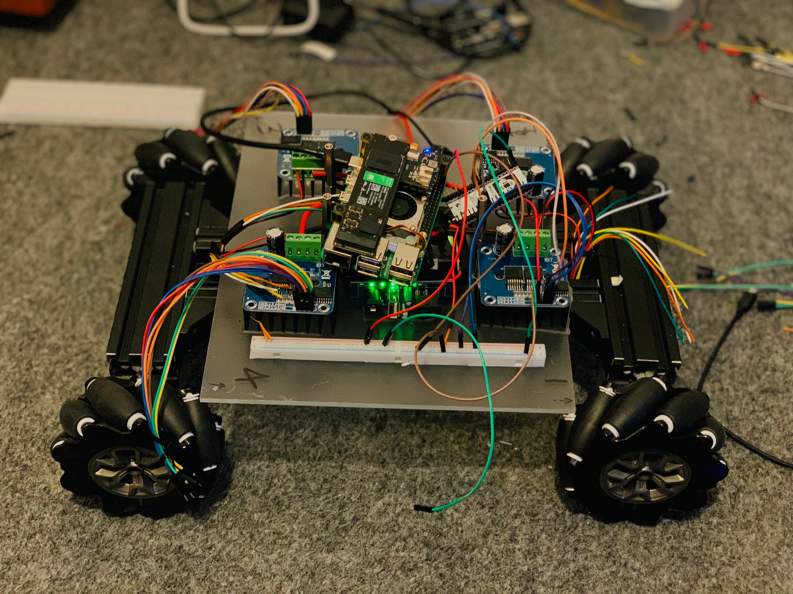

# AI Cameraman : Autonomous Photographic Camera  Control & Tracking System

## Overview

AI Cameraman (**also known as Autonomous Photographic camera control and tracking system**) --initiated on Apr 27, 2026-- is an autonomous robotics and embedded systems project focused on building a voice-interactive robotic cameraman capable of:

- tracking a human subject
- following the subject dynamically
- responding to voice commands
- capturing photos/videos from multiple cinematic angles

**The system combines robotics, embedded systems, real-time motor control, voice interaction, computer vision, autonomous navigation, and distributed system architecture.**

The long-term goal is to develop a fully autonomous robotic cinematography platform capable of intelligent movement, subject awareness, and voice-guided camera behavior.

---

## Current Prototype Stage:

[](https://sofiauniversity-my.sharepoint.com/:f:/g/personal/santosh_bogati_sofia_edu/IgA31v3vTGQQS7aVL7Cg1fQVARlYgo7sM40RWyne4M3HtHk?e=OIZYYl)
Click the image above to view project progress progress: 

---

### Currently Working: 

As of May 11, 2026, current development is focused on establishing a low-level SWD debugging and communication pipeline between STM32 and Raspberry Pi 5 using OpenOCD and GPIO-based SWD.

This process includes:

- ARM Cortex-M exploration *(completed)*
- bare-metal STM32 experimentation *(in progress)*
- OpenOCD configuration *(completed)*
- GPIO-based SWD communication *(completed)*
- register inspection *(completed)*
- flash memory analysis *(completed)*
- embedded debugging workflow development *(in progress)*
- vector table inspection *(completed)*
- Raspberry Pi 5 GPIO-based SWD debugging *(completed)*
- Linux GPIOD OpenOCD integration *(completed)*


### Current Engineering Milestones Completed

#### System Architecture

- Designed and organized full robotics repository architecture
- Built distributed robotics system architecture
- Integrated Raspberry Pi 5 as the high-level control system
- Organized firmware, hardware, tests, logs, and documentation subsystems

---

#### Embedded Systems Architecture Evolution

The project initially utilized ESP32-based motor control for rapid prototyping and communication experimentation.

As development progressed, limitations were identified in long-term debugging workflow, low-level hardware inspection capability, and scalability for the intended robotics architecture.

To support deeper embedded systems experimentation and more advanced debugging workflows, development transitioned toward STM32-based embedded control exploration.

This transition enabled:

- SWD debugging workflows
- ARM Cortex-M exploration
- register-level debugging
- flash memory inspection
- vector table analysis
- lower-level embedded systems experimentation
- OpenOCD-based debugging pipelines

The original ESP32 prototyping phase remains preserved within the repository as part of the project's engineering evolution.

---

#### STM32 Embedded Debugging

- Established GPIO-based SWD communication between Raspberry Pi 5 and STM32
- Successfully configured OpenOCD for Raspberry Pi 5 GPIO debugging
- Solved Raspberry Pi 5 `linuxgpiod` compatibility issue for OpenOCD
- Successfully detected and initialized ARM Cortex-M4 target
- Performed live ARM Cortex-M4 CPU register inspection
- Performed STM32 flash memory inspection
- Performed STM32 vector table inspection
- Successfully halted and reset STM32 through SWD debugging interface
- Explored ARM Cortex-M memory layout and execution flow
- Built low-level embedded debugging workflow using OpenOCD and Telnet

---

#### Communication Systems

- Implemented USB serial communication testing
- Implemented ESP32 ping/pong communication testing (initially, now transitioned to STM32)
- Established initial Raspberry Pi ↔ embedded controller communication pipeline (STM32)

---

#### Motor Control Systems

- Implemented single-motor text-command control testing
- Successfully controlled BTS7960 motor driver using PWM
- Designed initial 4-motor control architecture
- Tested forward, backward, and stop motor commands

---

#### Power System Integration

- Integrated buck converter for 12V → 5V power regulation
- Designed initial robot power distribution architecture
- Investigated grounding instability during motor operation

---

#### Hardware Integration

- Documented motor wiring and GPIO pin mapping
- Identified and corrected mirrored motor orientation issue
- Integrated mecanum wheel drive platform
- Integrated camera and microphone hardware


---


## Core System Objectives

The robot is being designed to:

- Identify and lock the human subject
- autonomously follow the locked-subject avoiding obstacles
- listen for voice commands especially during photo sessions and photograph accordingly (such as take portrait, take cinematic,..) 


---

## System Architecture

```text

Voice Commands
       ↓
Raspberry Pi 5
(High-Level Intelligence/RL)
       ↓
Decision Layer
       ↓
Communication Layer
       ↓
STM32F446RE Nucleo Board
(Transitioned from ESP32 prototype architecture to support deeper debugging workflows and more advanced embedded experimentation)
(Real-Time Embedded Control)
       ↓
BTS7960 Motor Drivers
       ↓
Mecanum Wheel Drive System
```

---

## Distributed Control Architecture

### Raspberry Pi 5 — High-Level System

Responsibilities:

- voice command processing
- future computer vision pipeline
- human tracking logic
- decision-making
- command generation
- system coordination

Hardware:

- Raspberry Pi 5
- 8GB RAM
- 500GB NVMe SSD

### STM32F446RE MCU NUCLEO-F446RE — Real-Time Embedded Controller

Responsibilities:

- PWM motor control
- real-time command execution
- low-latency motor response
- motor driver actuation
- future encoder processing

Communication:

- pi -- STM32 comms successful through SWD system

---


## Hardware Stack

### Core Components

- Raspberry Pi 5, 8GB
- 500GB NVMe SSD
- STM32F446RE Nucleo Board
(Transitioned from ESP32 prototype architecture to support deeper debugging workflows and more advanced embedded experimentation)
- 4 × BTS7960 motor drivers
- 4 × 12V DC motors with encoders
- Mecanum chassis
- 12V LiFePO4 battery
- Buck converter, 12V to 5V
- Logitech C270 camera
- Movo USB-1 microphone

### Additional Hardware

- XT60 connectors
- jumper wires
- breadboards
- acrylic mounting plates
- standoffs
- mounting tape
- motor wiring adapters

---

## Software Stack

### Raspberry Pi Side

- Python
- serial communication
- future voice processing
- future computer vision
- future autonomous behavior logic

### ESP32 Side

- Arduino C/C++
- PWM motor control
- serial command handling
- BTS7960 driver control

---

## Repository Structure

```text
AI-Cameraman/
│
├── 01_system/
│   ├── main.py
│   ├── voice/
│   │   ├── speech_listener.py
│   │   ├── command_parser.py
│   │   └── wake_word.py
│   ├── vision/
│   │   ├── camera_stream.py
│   │   ├── human_tracker.py
│   │   └── shot_framing.py
│   ├── decision/
│   │   ├── behavior_manager.py
│   │   ├── motion_planner.py
│   │   └── safety_rules.py
│   └── communication/
│       ├── serial_link.py
│       └── protocol.py
│
├── 02_firmware/
│   └── STM32_motor_controller/
│
├── 03_tests/
│   ├── motor_tests/
│   ├── uart_tests/
│   ├── voice_tests/
│   └── camera_tests/
│
├── 04_hardware/
│   ├── components.md
│   ├── wiring.md
│   ├── pinout.md
│   └── power_system.md
│
├── 05_assets/
│   └── robot_build_photos/
│
├── 06_logs/
│
├── 07_docs/
│   ├── architecture/
│   ├── troubleshooting/
│   └── development_notes/
│
├── README.md
├── LICENSE
└── requirements.txt
```

---

## Current Working Capabilities

Completed:

- STM32 -- Rasp-pi communication
- single motor text-command testing
- BTS7960 motor driver validation
- forward/backward/stop motor control
- initial 4-motor wiring setup
- power distribution design
- buck converter integration
- hardware documentation
- repository architecture organization

---

## Current Engineering Challenges

### Grounding Stability

A grounding instability issue was identified during motor testing.

Observed behavior:

- motors stopped unexpectedly when sharing certain ground paths
- grounding layout requires redesign and validation


---

## Hardware Notes

### Motor Orientation Adjustment

Because motors are mounted in mirrored orientation on the chassis, some motors initially rotated in opposite directions despite identical wiring.

This was corrected by reversing motor polarity on affected motors:

```text
OUT+ ↔ OUT-
```

This ensured consistent movement behavior across all wheels.

Detailed explanation available in:

```text
04_hardware/wiring.md
```

---

## Project Vision

The long-term vision of AI Cameraman is to create a fully autonomous robotic cinematography platform capable of:

- intelligent subject tracking
- voice interaction
- autonomous movement
- cinematic shot positioning
- AI-assisted camera behavior
- real-time robotic decision-making

---

## Author

Phoenix
